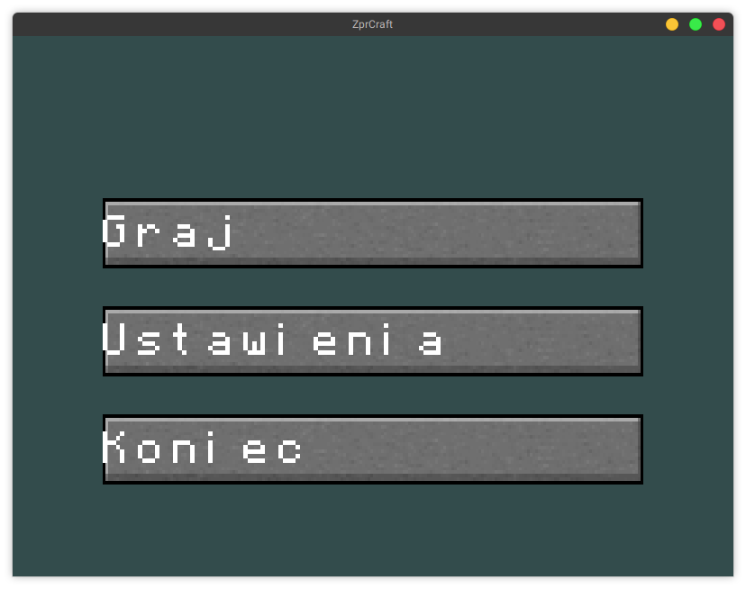
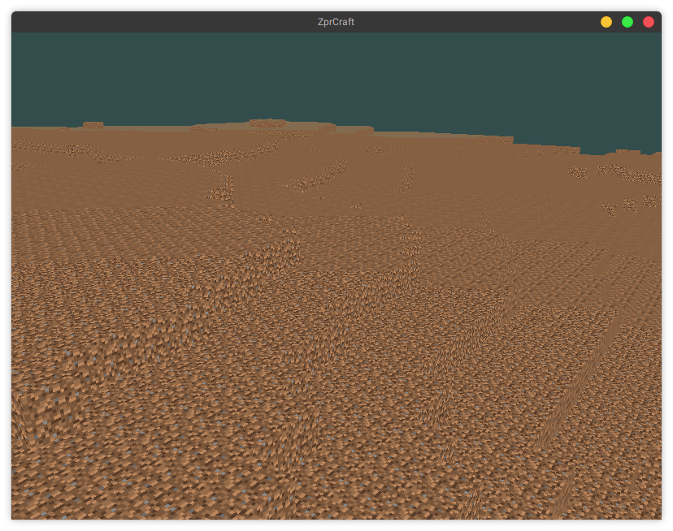

# ZprCraft - projekt na przedmiot ZPR

Gra jest wynikiem projektu na przedmiot ZPR

## Podgląd gry




## Kod źródłowy

Cały projekt jest napisany w `C++`.

### Światy i ich zapisywanie

W dokumentacji wstępnej napisaliśmy, że świat będzie miał `16x16x128`.
Da się to uzyskać zmieniają `map::Chunk::Size` w pliku `src/map/Chunk.cc` gdzieś w okolicach 10 lini.
Ale odradzam, gra nie jest na tyle zoptymalizowana, żeby komfortowo grać z tak dużym światem.

Światy zapisane są dość pokaźnej wielkości, około `10 MB` w początkowej formie i szybko rosną.
Dlatego po skończonych próbach programu polecam usunąć folder `~/.config/ZprCraft` lub zmienić zmienną `cfg_dir` w pliku `src/lib/AppSettings.cc:23` na inną dowolną.

### Sprytne wskaźniki

W całym projekcie, są używane sprytne wskaźniki typu `std::shared_ptr`.
Dodatkowo zdecydowana większość klas dziedziczy wirtualnie po klasie `std::enable_shared_from_this`.

W pewnym momencie, mieliśmy problem z funkcją `shared_from_this()`, okazuje się, że nie można wywołać jej w konstruktorze obiektu.
Dlatego ukryliśmy większość konstruktorów i zrobiliśmy funkcje statyczną create, która tworzy za nas obiekt i wywołuje inne instrukcje, które normalnie były by w konstruktorze.

### Zewnętrzne biblioteki

W projekcie znajdują się dodatkowo dwa pliki obcego pochodzenia:

 - `cfgpath.h` - plik nagłówkowy znajdujący się pod [tym](https://github.com/bogdanadnan/ariominer/blob/master/common/cfgpath.h) adresem.
   Autor pozawala na użycie w dowolnym celu.
    
 - `json.hpp` - biblioteka to formatu JSON na licencji MIT.

## Budowanie

### Biblioteki

Do kompilacji potrzebne są następujące programy/biblioteki: cmake, boost, OpenGL, GLM, GLEW, glfw3 i git.
Każda dystrybucja Linuxa zawiera te biblioteki i najczęściej są one już w systemie po instalacji systemu

Poniżej przedstawiono kilka przykładowe komendy do instalacji na wybranych systemach operacyjnych:

| System | Komenda |
| ------ | ------- |
| Ubuntu | `# apt-get install git cmake libboost-filesystem-dev libboost-test-dev libglm-dev libglew-dev libglfw3-dev g++` |
| ArchLinux | `# pacman -S git cmake glew glm boost glfw-x11 g++` |

### Kompilacja

Poniżej przedstawiono skrypt do kompilacji na systemie Linux

```
cd /tmp # tu można zmienić wedle upodobania

git clone https://github.com/jedrzejowski/zpr-project zpr-craft-jedrzejowski-kretkowski
cd zpr-craft-jedrzejowski-kretkowski

mkdir bin
cd bin
cmake ..
make
ctest
./zpr_app

```

## Autorzy

Adam Jędrzejowski <[adam@jedrzejowski.pl](mailto:adam@jedrzejowski.pl)>

Marcin Kretkowski
