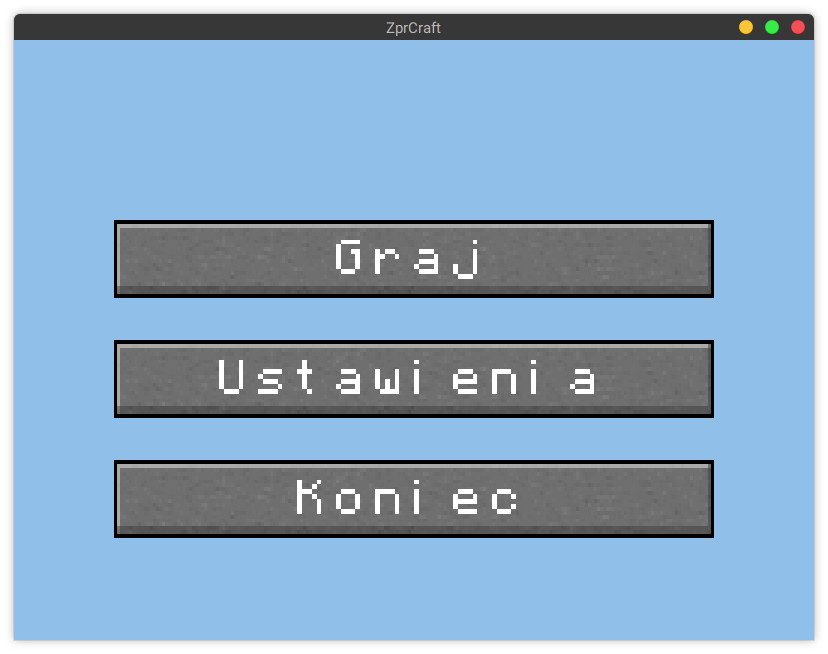

# ZprCraft - projekt na przedmiot ZPR

Gra jest wynikiem projektu na przedmiot ZPR

## Podgląd gry




## Budowanie

### Biblioteki

Do kompilacji potrzebne są następujące programy/biblioteki: cmake, boost, OpenGL, GLM, GLEW, glfw3 i git.
Każda dystrybucja Linuxa zawiera te biblioteki i najczęściej są one już w systemie po instalacji systemu

### Kompilacja

Poniżej przedstawiono skrypt do kompilacji na systemie Linux

```
cd /tmp # tu można zmienić wedle upodobania

git clone https://github.com/jedrzejowski/zpr-project zpr-craft-jedrzejowski-kretkowski
cd zpr-craft-jedrzejowski-kretkowski

mkdir bin
cmake -S . -B bin

cd bin
make

cd test
ctest

cd ..
./src/zpr_app

```


## Autorzy

Adam Jędrzejowski <adam@jedrzejowski.pl>
Marcin Kretkowski
