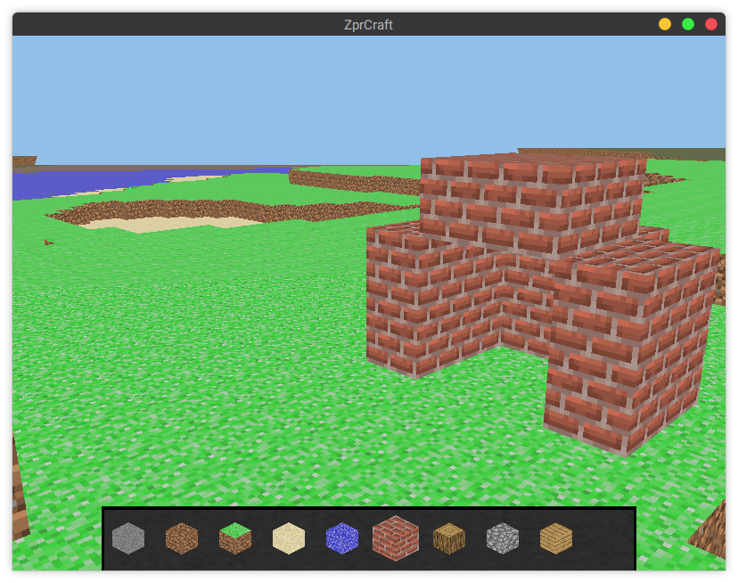

# ZprCraft - projekt na przedmiot ZPR

Gra jest wynikiem projektu na przedmiot ZPR

## Podgląd gry




## Opis gry

Gra to taka kopia Minecraft'a.
Użytkownik zaczyna na ekranie początkowym z trzema przyciskami: `Graj`, `Ustawienia` i `Koniec`.
Kierującymi odpowiednio do: ekranu z wyborem światów, ustawień i do wyjścia.

W menu wyboru światów, użytkownik ma możliwość utworzenia nowego świata, usunięcia świata (przcisk `X` po lewo od nazwy świata), resetu świata (przcisk `R` po prawo od nazwy świata), utworzenia świata lub powrotu.
Po utworzeniu świata lub wybraniu istniejącego, gracz kierowany jest do świata gry.
W przypadku istnienia wielu światów, które nie mieszczą się na ekranie, można je scrollować kierując myszkę w górne lub dolne części ekranu.

Gracz porusza się za pomocą popularnej kombinacji klawiszy `WASD`, wybór bloku odbywa się za pomoć przycisków od `1` do `9`.
Aby polecieć do góry należy wcisnąć `Space`, a w dół `Shift`.
Aby wyjść do menu należy kliknąć `Esc` na klawiaturze.
Bloki stawiamy prawym przyciskiem myszy a niszczymy lewym.

Użytkownik ma możliwość zmiany dwóch parametrów rozgrywki: zasięgu renderowania i kąta widzenia.

Wszystkie światy i ustawienia są zapisywane do plików w folderze konfiguracji użytkownika.
I możne do nich bezpiecznie powrócić, po restarcie gry.

## Kod źródłowy

Cały projekt jest napisany w `C++`.

### Architektura

Cały program podzielony jest na następujące składowe: ślinik(`engine`), bloki(`blocks`), gra główna(`engine`), mapa(`map`) i menu(`menu`).
Program wyświetla okno, na którym są wyświetlane sceny(`engine::Scene`). Sceny mogą mieć interfejsy 2D(`gui::Interface`) i zestawy obiektów 3D(`engine::Abs3DObj` i `engine::Sub3DObj`), które są na niej wyświetlane.

### Światy i ich zapisywanie

W dokumentacji wstępnej napisaliśmy, że świat będzie miał `16x16x128`.
Da się to uzyskać zmieniają `map::Chunk::Size` w pliku `src/map/Chunk.cc` gdzieś w okolicach 10 lini.
Ale odradzam, gra nie jest na tyle zoptymalizowana, żeby komfortowo grać z tak dużym światem.

Światy zapisane w pliku są dość pokaźnej wielkości, około `10 MB` w początkowej formie i szybko rosną.
Dlatego po skończonych próbach programu polecam usunąć folder `~/.config/ZprCraft` lub zmienić zmienną `cfg_dir` w pliku `src/lib/AppSettings.cc:23` na inną dowolną.

### Sprytne wskaźniki

Na początku chcieliśmy zrobić obiektu w rodzaju drzewa obiektów z `QT`, ale wraz z rozwojem kodu i jego skomplikowania przenieśliśmy się na sprytne wskaźniki.
Ułatwiło to znalezienie licznych wycieków pamięci oraz zwiększyło czytelność kodu.
 
Użyliśmy typu `std::shared_ptr`.
Dodatkowo zdecydowana większość klas dziedziczy wirtualnie po klasie `std::enable_shared_from_this`.

W pewnym momencie, mieliśmy problem z funkcją `shared_from_this()`, okazuje się, że nie można wywołać jej w konstruktorze obiektu.
Dlatego ukryliśmy większość konstruktorów i zrobiliśmy funkcje statyczną `create`, która tworzy za nas obiekt i wywołuje inne instrukcje, które normalnie były by w konstruktorze.
Dzięki czemu mamy pewność, że obiekt będzie utworzony wraz ze sprytnym wskaźnikiem i ukrywamy wtedy brzydkie części biblioteki standardowej.

Pod koniec doszliśmy do wniosku, że implementacja sprytnych wskaźników wszędzie była błędem.
Program działa nam powolno(ale działa).
Bloki, jako proste struktury danych powinny być zrobione jako normalne wskaźniki.

### Zewnętrzne biblioteki

W projekcie znajdują się dodatkowo dwa pliki obcego pochodzenia:

 - `cfgpath.h` - plik nagłówkowy znajdujący się pod [tym](https://github.com/bogdanadnan/ariominer/blob/master/common/cfgpath.h) adresem.
   Autor pozawala na użycie w dowolnym celu.
   Pozwala na ustalenie folderu z konfiguracją użytkownika
    
 - `json.hpp` - biblioteka to formatu JSON na licencji MIT.
 
 - `stb_image.h` - bibliotek do wczytywania plików obrazów.
   Opublikowana na licencji publicznej.

## Budowanie

### Biblioteki

Do kompilacji potrzebne są następujące programy/biblioteki: `cmake`, `boost`(tylko testy), `OpenGL`, `GLM`, `GLEW` i `glfw3`, oraz `git` do pobrania kod źródłowego.
Każda dystrybucja Linuxa zawiera te biblioteki i najczęściej są one już w systemie po instalacji systemu z podstawowymi narzędziami programistycznymi.

Poniżej przedstawiono kilka przykładowe komendy do instalacji na wybranych systemach operacyjnych:

| System | Komenda |
| ------ | ------- |
| Ubuntu | `# apt-get install git cmake libboost-test-dev libboost-filesystem-dev libglm-dev libglew-dev libglfw3-dev g++` |
| ArchLinux | `# pacman -S git cmake glew glm boost glfw-x11 g++` |

### Kompilacja

Poniżej przedstawiono skrypt do kompilacji na systemie Linux

```
cd /tmp # tu można zmienić wedle upodobania

git clone https://github.com/jedrzejowski/zpr-project zpr-craft-jedrzejowski-kretkowski
cd zpr-craft-jedrzejowski-kretkowski

mkdir bin
cd bin
cmake ..
make
./test # przprowadzenie testów
./zpr_app # uruchomienie apilakcji

```

## Inne

Niestety nie monitorowaliśmy czasu spędzonego na projekt.

## Autorzy

Adam Jędrzejowski <[adam@jedrzejowski.pl](mailto:adam@jedrzejowski.pl)>

Marcin Kretkowski
